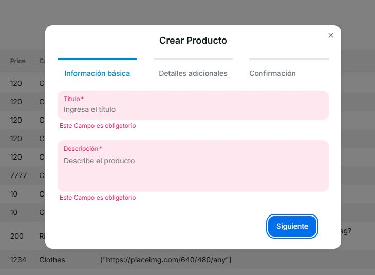

# MultiStep Form en NEXT14

Hecho por: Nicolas Escandon Varela

Me he basado en una plantilla de Next.js 14 (app directory) and NextUI (v2) para facilitar algunas configuraciones y estilos para el proyecto.

La aplicación interactúa con la `FakeAPI de Platzi` para obtener las categorías de los productos y enviar los datos de los nuevos productos a la API. Por lo Tanto no he incluido el `.env` en el `.gitignore` 

 Implementé la persistencia de datos usando localStorage y una React Context API, así que no perderán su progreso si recargan la página. (de hecho solo se borran desde la herramientas de navegador)

## Technologias Utilizadas

- [Next.js 14](https://nextjs.org/docs/getting-started)
- [NextUI v2](https://nextui.org/)
- [Tailwind CSS](https://tailwindcss.com/)
- [Tailwind Variants](https://tailwind-variants.org)
- [TypeScript](https://www.typescriptlang.org/)
- [Framer Motion](https://www.framer.com/motion/)
- [next-themes](https://github.com/pacocoursey/next-themes)

## Instalación

### Clonar el Repo

```bash
git clone https://github.com/NEV117/multi-step-form-nextjs.git
```

### Instalar dependecias

Puedes usar cualquiera de estas `npm`, `yarn`, `pnpm`, `bun`, Ejemplo usando `npm`:

```bash
npm install
```

### Correr development server

```bash
npm run dev
```

## Preview

Formulario:

<p align="center">
  
</p>


Tabla (Filtra por `Nombre` del producto):
<p align="center">
  
</p>


Valida que los campos no sean nulos:
<p align="center">
  
</p>